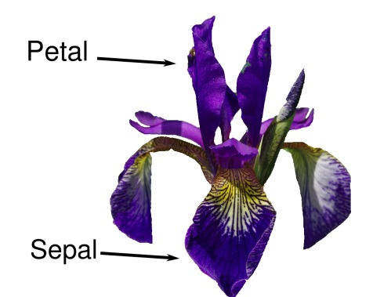
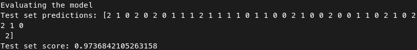

# Classificando espécies de Íris usando Algoritmo K-Neighbors de Machine Learning.

## O programa utiliza-se do módulo KNeighborsClassifier do Scikit-Learn para poder classificar as espécies.

### Introdução
O objetivo deste projeto é aprender alguns algoritmos de Machine Learning, neste caso, o K-Neighbors.

Aqui nós utilizamos da base de dados oferecida pelo próprio Scikit Learn importando "load_iris" do módulo "sklearn_datasets". 

Esta base de dados nos fornece 4 parâmetros que são: largura da pétala, largura da sépala, comprimento da pétala e comprimento da sépala. E também nos fornece um array contendo a espécie de cada íris. Podendo ser: virgínica, setosa ou versicolor.



Dessa forma nós separamos esses dados, tal que 75% desses dados são usados para o treinamento do modela de Machine Learning e 25% são usados para os testes.

Com os dados separados corretamente, podemos treinar o modelo e já fazer as predições para os 25% que não foram usados no treinamento.

> Os dados de treinamento não podem ser usados para fazer os testes.

Após os testes, é calculado a precisão do nosso modelo. 



Como mostra a imagem acima, o modelo tem uma precisão de 97%.

### Como rodar na sua máquina:

#### Requisitos:

> Ter o python instalado em sua última versão;

> Ter as bibliotecas: Pandas, Sklearn e Numpy instaladas em sua última versão.

#### Para rodar: 

```bash
$ git clone https://github.com/JotahIvo/classifying-iris-species.git
```

```bash
$ cd classifying-iris-species
$ python classification_problem.py
```

## Muito obrigado!